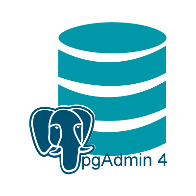

# FastAPI + React · [](https://circleci.com/gh/MaxRichter/fastapi-celery) [](LICENSE)

<div>
 
 

 


</div>

A cookiecutter template for bootstrapping a FastAPI and Celery project using a
modern stack.

---

## Features

- **[FastAPI](https://fastapi.tiangolo.com/)** (Python 3.8)
  - JWT authentication using [OAuth2 "password
    flow"](https://fastapi.tiangolo.com/tutorial/security/simple-oauth2/) and
    PyJWT
- **[PostgreSQL](https://www.postgresql.org/)** for the database
- **[SqlAlchemy](https://www.sqlalchemy.org/)** for ORM
- **[pgAdmin](https://www.pgadmin.org/)** for database management
- **[Alembic](https://alembic.sqlalchemy.org/en/latest/)** for database
  migrations
- **[Celery](http://www.celeryproject.org/)** for [background
  tasks](#background-tasks) and [Redis](https://redis.io/) as a message broker
  - Includes [Flower](https://flower.readthedocs.io/en/latest/) for task monitoring
- **[Flower](https://flower.readthedocs.io/en/latest/)** for monitoring and administrating Celery cluster
- **[Redis](https://redis.io/)** for storing Celery results
- **[RabbitMQ](https://www.rabbitmq.com/)** as task broker for Celery
- **[Pytest](https://docs.pytest.org/en/latest/)** for backend tests
  - Includes test database, transaction rollbacks after each test, and reusable
    [Pytest fixtures](#fixtures).
- **[Prettier](https://prettier.io/)**/**[ESLint](https://eslint.org/)** (Airbnb
  style guide)
- **[Docker Compose](https://docs.docker.com/compose/)** for development
- **[Nginx](https://www.nginx.com/)** as a reverse proxy to allow
  backend/frontend on the same port

## Table of Contents

- [Background](#background)
- [Quick Start](#quick-start)
- [Develop](#develop)
- [Security](#security)
- [Testing](#testing)
  - [Fixtures](#fixtures)
- [Background Tasks](#background-tasks)
  - [Flower](#flower)
- [Contributing](#contributing)

## Background

It is often laborsome to start a new project. 90% of the time you have to decide
how to handle authentication, reverse proxies, docker containers, testing,
server-side validation, linting, etc. before you can even get started.

**FastAPI-Celery** serves to streamline and give you that functionality out of
the box.

It is meant as a lightweight backend-only alternative to [FastAPI's official fullstack
project](https://github.com/tiangolo/full-stack-fastapi-postgresql). If you want
a more comprehensive project in Vue, I would suggest you start there. A lot of
the backend code is taken from that project or the [FastAPI official
docs](https://fastapi.tiangolo.com/).

## Quick Start

First, install cookiecutter if you don't already have it:

```bash
pip install cookiecutter
```

Then, in the directory you want your project to live:

```bash
cookiecutter gh:MaxRichter/fastapi-celery
```

You will need to put in a few variables and it will create a project directory
(called whatever you set for `project_slug`).

<details><summary>Input Variables</summary>

- project_name [default fastapi-celery-project]
- project_slug [default fastapi-celery-project] - this is your project directory
- port [default 8000]
- postgres_user [default postgres]
- postgres_password [default postgrespassword]
- postgres_database [default app]
- pgadmin_user [1234@admin.com]
- pgadmin_password [1234]
- pgadmin_port [5050]
- rabbitmq_user [admin]
- rabbitmq_password [mypass]
- rabbitmq_port [5672]
- rabbitmq_admin_port [15672]
- superuser_email [default admin@fastapi-celery-project.com]
- superuser_password [default appadminpassword]
- secret_key [default super_secret_to_replace]

</details>

## Develop

Change into your project directory and run:

```bash
chmod +x scripts/build.sh
./scripts/build.sh
```

This will build and run the docker containers, run the alembic migrations, and
load the initial data (a test user).

It may take a while to build the first time it's run since it needs to fetch all
the docker images.

Once you've built the images once, you can simply use regular `docker-compose`
commands to manage your development environment, for example to start your
containers:

```bash
docker-compose up -d
```

Once this finishes you can navigate to the port set during setup (default is
`localhost:8000`), you should see the 404 Code from Nginx:


_Note: If you see an Nginx error at first with a `502: Bad Gateway` page, you
may have to wait for webpack to build the development server (the nginx
container builds much more quickly)._

The backend docs will be at `http://localhost:8000/api/docs`. 

Access to the PostgreSQL server will be at `http://localhost:5050/`.


Finally, Flower can be reached at `http://localhost:5555/`.


## Security

To generate a secure key used for encrypting/decrypting the JSON Web Tokens, you
can run this command:

```bash
openssl rand -hex 32
```

The default is fine for development but you will want something more secure for
production.

You can either set this on project setup as `secret_key` or manually edit the
Python `SECRET_KEY` variable in `backend/app/core/security.py`.

## Testing

This project comes with Pytest and a few Pytest fixtures for easier mocking. The
fixtures are all located in `backend/conftest.py` within your project directory.

All tests are configured to run on a test database using [SQLAlchemy
transactions](https://docs.sqlalchemy.org/en/13/orm/session_transaction.html) to
reset the testing state on each function. This is to avoid a database call
affecting the state of a different test.

### Fixtures

These fixtures are included in `backend/conftest.py` and are automatically
imported into any test files that being with `test_`.

#### test_db

The `test_db` fixture is an empty test database and an instance of a SQLAlchemy
Session class.

```python
def test_user(test_db):
    assert test_db.query(models.User).all()
```

#### test_user

```python
def test_user_exists(test_user):
    assert test_user.email == "admin@example.com"
```

#### test_superuser

```python
def test_superuser(client, test_superuser):
    assert test_superuser.is_superuser
```

#### client

To use an unauthenticated test client, use `client`:

```python
def test_get_users(client):
    test_client.get("/api/v1/users")
    assert response.status_code == 200
```

#### user_token_headers

If you need an authenticated client using OAuth2 and JWTs:

```python
def test_user_me(client, user_token_headers):
    response = client.get(
      "/api/v1/users/me",
      headers=user_token_headers,
    )
    assert response.status_code == 200
```

Since OAuth2 expects the access token in the headers, you will need to pass in
`user_token_headers` as the `headers` argument in any client request that
requires authentication.

#### superuser_token_headers

```python
def test_user_me(client, superuser_token_headers):
    response = client.get(
      "/api/v1/users",
      headers=superuser_token_headers,
    )
    assert response.status_code == 200
```

## Background Tasks

This template comes with Celery and Redis Docker containers pre-configured for
you. For any long running processes, it's recommended that you handle these
using a task queue like Celery to avoid making the client wait for a request to
finish. Some examples of this might be sending emails, uploading large files, or
any long running, resource intensive tasks.

There is an example task in `backend/app/tasks.py` and an example Celery test in
`backend/app/tests/test_tasks.py`. This test runs synchronously, which is what
Celery docs recommend.

### Flower

You can monitor tasks using Flower by going to http://localhost:5555

## Contributing

Contributing is more than welcome. Please read the [Contributing
doc](CONTRIBUTING.md) to find out more.
